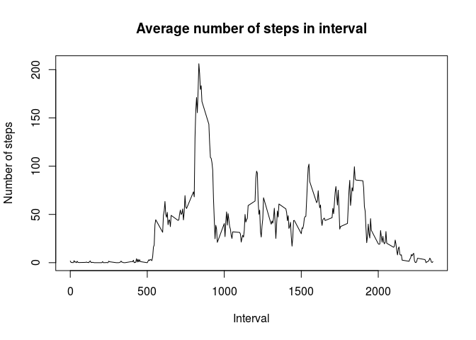
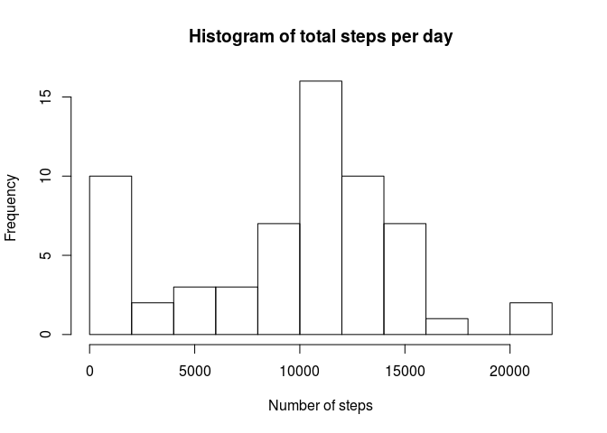
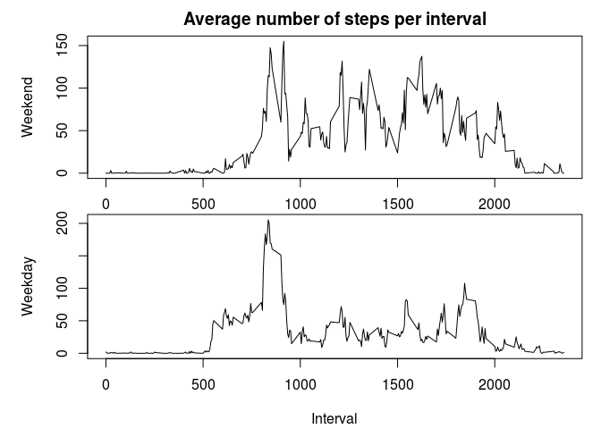

# Reproducible Research: Peer Assessment 1

## Loading and preprocessing the data


```r
df <- read.csv(unzip("activity.zip", "activity.csv"), colClasses=c("numeric", "Date","numeric"))
```


## What is mean total number of steps taken per day?


```r
require(dplyr)

day.totals <- df %>% 
  group_by(date) %>%
  summarise(total=sum(steps, na.rm=TRUE))
```


```r
hist(day.totals$total, xlab="Number of steps", main="Histogram of total steps per day", breaks=8)
```

 


```r
mean.perday <- mean(day.totals$total)
median.perday <- median(day.totals$total)
```

The mean total number of steps per day is 9354.23 and the median 1.0395\times 10^{4} stes per day. 


## What is the average daily activity pattern?

```r
intervals <- df %>% 
  group_by(interval) %>%
  summarise(average=mean(steps, na.rm=TRUE),
            median=median(steps, na.rm=TRUE))

plot(intervals$interval, intervals$average, type="l",
xlab="Interval", ylab="Number of steps", main="Average number of steps in interval")
```

 

```r
max.interval <- intervals[which.max(intervals$average),1]
```


The largest average number of steps across all days is in interval 835. 

## Imputing missing values


```r
nas <- sum(is.na(df$steps))
```

The number of missing values in the dataset is 2304. 

Imputation of missing values is done using the median value for the particular interval.  No, this is not a particularly sophisticated strategy. 


```r
df.new <- df

int.medians <- intervals$median[match(df$interval[is.na(df$steps)], intervals$interval)]

df.new$steps[is.na(df.new$steps)]<- int.medians
```


```r
day.totals.new <- df.new%>% 
  group_by(date) %>%
  summarise(total=sum(steps, na.rm=TRUE))
```


```r
hist(day.totals.new$total, xlab="Number of steps", main="Histogram of total steps per day", breaks=8)
```

 
The histogram is exactly the same as the previous one, since the imputed days now have a total of 1141 as opposed to zero and hence fall into the first bin in both instances. 

```r
mean.perday.new <- mean(day.totals.new$total)
median.perday.new <- median(day.totals.new$total)
```

The mean total number of steps per day is 9503.87 and the median 1.0395\times 10^{4} stes per day. The mean is therefore slightly higher than before the imputation, while the median has stayed the same. 

## Are there differences in activity patterns between weekdays and weekends?

First create the new variable "weekday":

```r
df.new <- df.new %>%
  mutate( weekday=ifelse(weekdays(date) == "Saturday" | 
                           weekdays(date) == "Sunday", "weekend", "weekday"))
```

Then two tables, one with the averges for weekdays, one for weeknds:

```r
days <- df.new %>% 
  group_by(interval, weekday) %>%
  summarise(average=mean(steps, na.rm=TRUE))

weekend <- filter(days, weekday == "weekend")
not.weekend <- filter(days, weekday == "weekday")
```

Then Plot them both:

```r
par(mfrow=c(2,1),
    mar=c(2.1, 5.1, 2.1, 1.1))
plot(weekend[,1][[1]], weekend[,3] [[1]], type="l", ylab="Weekend", main="Average number of steps per interval")
  par( mar=c(4.1, 5.1, 0, 1.1))
plot(not.weekend[,1][[1]], not.weekend[,3] [[1]], type="l", ylab="Weekday", 
xlab="Interval")
```

 


